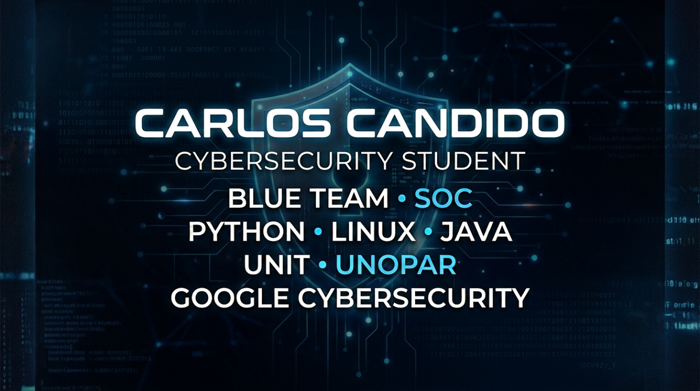

  

# 👋 Olá, eu sou Carlos Candido

Sou estudante de **Cibersegurança** apaixonado por tecnologia e Segurança da Informação.

Atualmente estou construindo um portfólio prático voltado para **Blue Team**, **SOC**, **Resposta a Incidentes** e **Automação com Python**.

Meu objetivo é conquistar uma oportunidade como **Analista de Segurança da Informação**, contribuindo para ambientes seguros através de monitoramento, análise e resposta a incidentes.

---

## 🎓 Formação Acadêmica

- 🎓 Tecnólogo em Cibersegurança — Universidade Pitágoras UNOPAR
- 🎓 Análise e Desenvolvimento de Sistemas — Centro Universitário Tiradentes (UNIT-PE)

---

## 📚 Atualmente estudando

- 🟡 Google Cybersecurity Professional Certificate
- 🟡 Microsoft SC-900
- 🟡 Microsoft AZ-900
- 🐍 Python
- 🐧 Linux
- 🌐 Redes de Computadores
- 🔐 Segurança da Informação
- ☁️ Cloud Computing

<h2 align="center">💻 Tecnologias e Ferramentas</h2>

<h2 align="center">📊 Estatísticas do GitHub</h2>

<!-- ====================================================== -->
<!-- PROJECTS -->
<!-- ====================================================== -->

<!-- ====================================================== -->
<!-- ROADMAP -->
<!-- ====================================================== -->

<!-- ====================================================== -->
<!-- CERTIFICATIONS -->
<!-- ====================================================== -->

<!-- ====================================================== -->
<!-- CONTACT -->
<!-- ====================================================== -->

# 🛡️ Cybersecurity Roadmap

Este repositório documenta toda minha evolução profissional na área de Segurança da Informação.

## 👨‍💻 Sobre mim

🎓 Tecnólogo em Cibersegurança
Universidade Pitágoras UNOPAR

🎓 Análise e Desenvolvimento de Sistemas
Centro Universitário Tiradentes (UNIT-PE)

🎯 Objetivo

Ingressar como Analista de Segurança da Informação, atuando em SOC (Security Operations Center), Blue Team e Resposta a Incidentes.

---

# Atualmente estudando

- Google Cybersecurity Professional Certificate
- Microsoft SC-900
- Microsoft AZ-900
- Python
- Linux
- Redes
- Git
- GitHub
- TryHackMe

---

# Roadmap

- [ ] Linux
- [ ] Redes
- [ ] Python
- [ ] Git
- [ ] Active Directory
- [ ] Windows Server
- [ ] OWASP
- [ ] SIEM
- [ ] Wazuh
- [ ] Splunk
- [ ] Docker
- [ ] AWS
- [ ] Azure
- [ ] DevSecOps

---

# Certificações

🟡 Google Cybersecurity Professional Certificate

🟡 Microsoft SC-900

🟡 Microsoft AZ-900

⬜ Security+

⬜ CCNA

---

# Projetos

- Python para Segurança
- Linux
- Redes
- SIEM
- Blue Team
- Active Directory
- TryHackMe

---

# Atualizações Semanais

Toda semana adiciono novos laboratórios, projetos e aprendizados.
